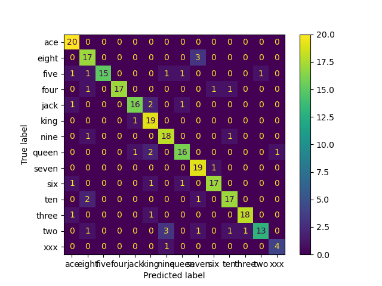

# Machine Learning Project Library

Card dataset for CNN
- https://www.kaggle.com/datasets/gpiosenka/cards-image-datasetclassification

Results:
- Trained with 5 epochs, batch size of 32
- classifies based on rank
- xxx is the joker class

