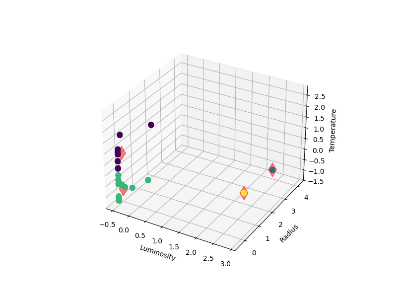

# Machine Learning Project Library

## Card dataset for CNN
- https://www.kaggle.com/datasets/gpiosenka/cards-image-datasetclassification

Results:
- Trained with 5 epochs, batch size of 32
- classifies based on rank
- xxx is the joker class

Each class has 20 cards, 4 suits x 5 samples. Joker only has 5 samples.

Twos were misclassified the most with only 13/20 cards successfully classified. Overall, my model fits the data well with minimal training time. 

## Star Dataset for KMeans Clustering
- https://www.kaggle.com/datasets/waqi786/stars-dataset

Results

First, I grid searched for best cluster fit

I decided I would cluster using 4 clusters

As you can see, majority of the points have ended up in one cluster with a few outliers. I wanted a better look into the main cluster so I dropped 3 of the clusters and did the process again

I chose 4 clusters again

This time I could see a bit better into the main cluster. Again there seems to be some outliers but, the main cluster is a bit more spread out. WIth the two clusters we can see some distinct types of stars.

## SVC Bagging and Random Forrest
- https://www.kaggle.com/datasets/christianlillelund/csgo-round-winner-classification

Results:

The goal of this project was to explore bagging using random forrests and svc. The dataset is on a game called Counter-strike. The dataset is comprised of hundreds of professional rounds played. Normally, this dataset is used to classify which team won the round however I wanted to classify which map is played on. I thought this was acheivable because in professional matches, each map is played somewhat distinctly from eachother.

Surprisingly, SVC did not classify the maps well. 

Random Forrest did much better classifying the maps.

The accuracy of the Bagging SVC was 0.215, where as the Random Forrest had an accuracy of 0.711.

It's also important to look at the "Out of bag" score for each model, this is like a test score of each model.

The OOB score for the Bagging SVC was 0.214, where as the Random Forrest had an OOB Score of 0.433.

This shows that the SVC was consistently underperforming where as the Random forrest was overfitting but still getting better results.

## Ridge From Scratch
- https://www.kaggle.com/datasets/ericpierce/austinhousingprices

The goal of this assignment was to understand how ridge regression works and implement it in code.

The dataset is on Austin Housing prices. This dataset was chosen because we are trying to highlight ridge regression's strength. We want the dataset to overfit with regular linear regression.

Linear (train): 0.511
Linear (test): 0.458
SkLearn Ridge (train): 0.511
SkLearn Ridge (test): 0.458
My Ridge (train): 0.511
My Ridge (test): 0.458

Even with only 5% of the dataset in the train split, I could not get the model to overfit greatly. However my implementation of ridge worked just as well as the professional library. 
